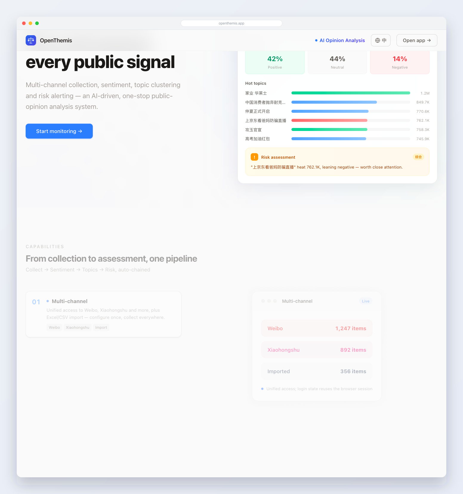
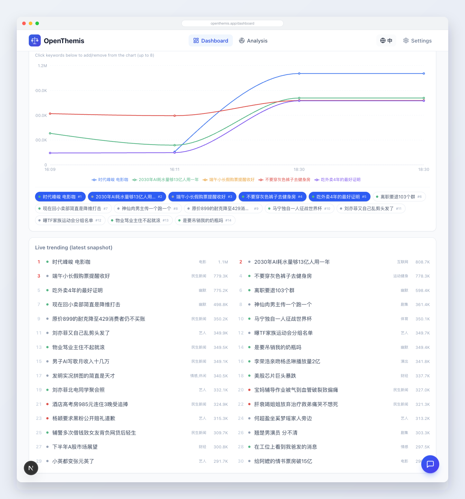
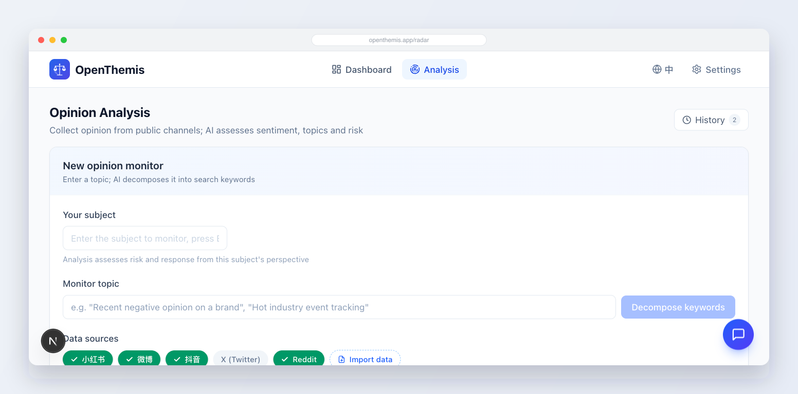
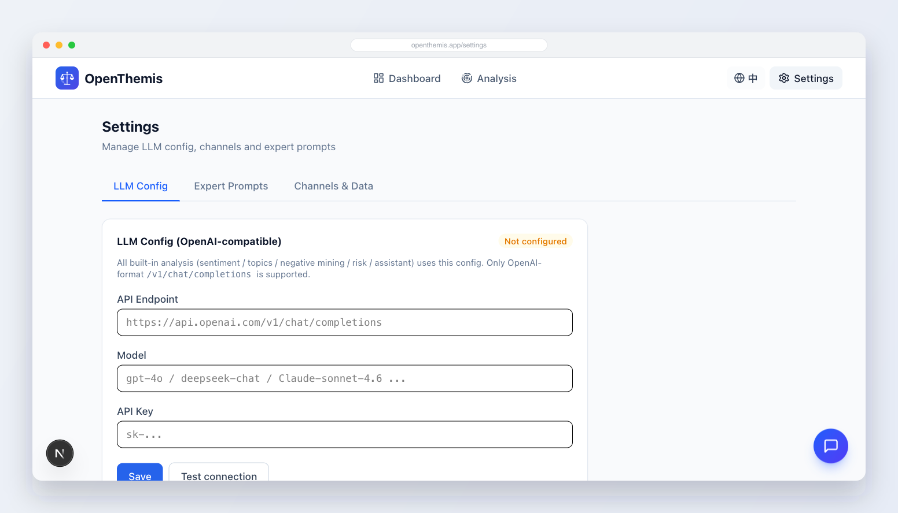

# OpenThemis — AI Public-Opinion (Sentiment) Analysis System

> Multi-channel collection, sentiment assessment, topic clustering, and risk alerting — one-stop AI public-opinion analysis.

**English** · [简体中文](README.md)

<p>
  <a href="https://github.com/E2ern1ty/openthemis/stargazers"></a>
  <a href="https://github.com/E2ern1ty/openthemis/network/members"></a>
  <a href="LICENSE"></a>
  
  
</p>

> Find it useful? Give it a ⭐ **[Star](https://github.com/E2ern1ty/openthemis)** to help others discover it.

---

## 1. Overview

OpenThemis is an **AI-driven public-opinion (舆情) analysis system** for brand, PR, and operations teams. It automatically collects public-opinion data from open channels and runs it through an AI pipeline — sentiment classification, topic clustering, negative-signal mining, and risk assessment — helping users grasp the public-opinion landscape quickly and catch risks early.

## 2. Core Features

An automatically chained **"Collect → Sentiment → Topics → Risk"** analysis pipeline:

1. **Multi-channel collection** — Unified access to open channels such as Weibo, Xiaohongshu, Douyin, X (Twitter), and Reddit, plus Excel/CSV import. Login state reuses your browser session, so no separate in-app login is needed.
2. **Sentiment assessment** — Classifies every item as positive / neutral / negative and quantifies the overall opinion health and mood trend.
3. **Topic clustering** — Automatically identifies core discussion topics and their sentiment, surfacing high-heat and high-negativity issues.
4. **Risk alerting** — Mines negative opinion, judges severity (systemic flaw vs. occasional complaint), and distills key findings with response suggestions.

A **page-aware AI assistant** is also available globally, answering questions in real time based on the current page's data.

## 3. Screenshots

### Home · Live opinion overview
On startup, randomly pulls trending topics from Weibo / Reddit and shows live sentiment distribution, hot topics, and risk assessment (source switchable).

<p align="center"></p>

### Dashboard · Scheduled refresh + topic-keyword trends
Switch between Weibo / Reddit sources, with 30s / 1 / 5 / 10-minute scheduled refresh, a line chart of keyword heat over time, plus sentiment distribution, category distribution, and a live trending list.

<p align="center"></p>

### Analysis · Multi-channel collection & assessment
Enter a monitoring topic; the AI decomposes it into keywords, collects across channels, and outputs sentiment, topics, negative-signal mining, and assessment.

<p align="center"></p>

### Settings · LLM config (OpenAI-compatible)
All built-in analysis runs through a visually configured, OpenAI-compatible LLM, with hot-reload and a connection test.

<p align="center"></p>

## 4. Architecture (3 layers, independently deployable/replaceable)

```
┌─────────────────┐   HTTP contract   ┌──────────────────┐   spawn   ┌──────────────────────┐
│  Analysis layer │ ────────────────▶ │  Collector layer │ ────────▶ │  OpenCLI             │
│  Next.js + LLM  │                   │ (OpenCLI gateway)│           │  (reuses Chrome session) │
│  unified LLM    │ ◀──── data ────── │  unified channels│           └──────────────────────┘
└────────┬────────┘                   └──────────────────┘
         │ Repository
┌────────▼────────┐
│  Storage layer  │   SQLite (better-sqlite3, WAL)
└─────────────────┘
```

- **Analysis layer** — A full-stack Next.js 16 app. All built-in analysis goes through `lib/llm.ts` (OpenAI-compatible only); configuration hot-reloads from the Settings page.
- **Collector layer** — A standalone Node process (`collector/`). All channels are accessed uniformly via [OpenCLI](https://github.com/jackwener/OpenCLI) `opencli <site> search`, reusing the user's Chrome session. See `collector/README.md`.
- **Storage layer** — SQLite, single-file and zero-config.

### Tech stack

| Layer | Tech |
|-------|------|
| Framework | Next.js 16 (App Router) + React 19 |
| Styling/Motion/Charts | Tailwind CSS 4 · Framer Motion · Recharts |
| Database | SQLite (better-sqlite3, WAL) |
| LLM | OpenAI-compatible endpoint (configurable) |
| Collection | OpenCLI browser bridge |
| Language | TypeScript 5.8 |

## 5. Getting Started

### Requirements
- Node.js 18+ (the collector needs OpenCLI, which requires Node ≥ 21)
- For collection: install [OpenCLI](https://github.com/jackwener/OpenCLI) (`npm i -g @jackwener/opencli`) + its Chrome browser extension, and log into the target platforms in Chrome.

### Install

```bash
npm run setup     # = npm install + collector dependencies
```

> Or install separately: root `npm install`; collector `npm --prefix collector install`.

### Development

```bash
# Start collector (:4001) + analysis app (:3000) together
npm run dev:all

# Or run them in two terminals:
npm run collector    # collector → http://localhost:4001
npm run dev          # analysis  → http://localhost:3000
```

### Production (npm)

```bash
npm run build        # build the analysis app
npm run collector &  # start the collector in the background (needs host Chrome)
npm run start        # start the analysis app → http://localhost:3000
```

> In production, use a process manager such as `pm2` to run the collector and analysis processes separately, with auto-start and crash-restart.

### Configure the LLM
Go to `Settings → LLM Config`, fill in the OpenAI-compatible Endpoint / Model / API Key, and test the connection. Environment variables `LLM_ENDPOINT / LLM_API_KEY / LLM_MODEL` can be used as a fallback (see `.env.example`).

### Typical flow
1. Settings → Channels: confirm a channel is logged in (log into the platform in Chrome).
2. Analysis → New monitor: enter a topic; the AI decomposes keywords and collects across channels.
3. View the report: sentiment distribution, topic heat, negative-signal mining, and assessment on one screen.

### Analysis-only (servers without a desktop Chrome)

The collector needs a host Chrome and **cannot run on a headless server**. Such environments can deploy the analysis layer only: analyze data imported via Excel / CSV / ReviewMine; the live Weibo data on the home page and dashboard gracefully falls back to built-in samples.

```bash
npm install && npm run build && npm run start
```

## 6. Project Structure

```
.
├── app/                  # Next.js App Router
│   ├── page.tsx          # Home
│   ├── radar/            # Analysis module
│   ├── settings/         # Settings (LLM config / channels / prompts)
│   └── api/              # API endpoints (channels / radar / prompts / llm-config / assistant ...)
├── components/           # UI components (layout / radar / dashboard)
├── lib/                  # Core libraries
│   ├── llm.ts            # Unified LLM client (OpenAI-compatible)
│   ├── agent.ts          # Analysis agents (sentiment/topics/negative/assessment)
│   ├── analysis.ts       # Analysis pipeline orchestration
│   ├── collector-client.ts # Collector HTTP client
│   ├── data-adapter.ts   # Data adapters (channels + import)
│   ├── db.ts             # SQLite
│   └── types.ts          # Type definitions
├── collector/            # Collector layer (standalone OpenCLI gateway process)
└── data/                 # Runtime data (SQLite, gitignored)
```

## License

[MIT](LICENSE) © 2026 OpenThemis
