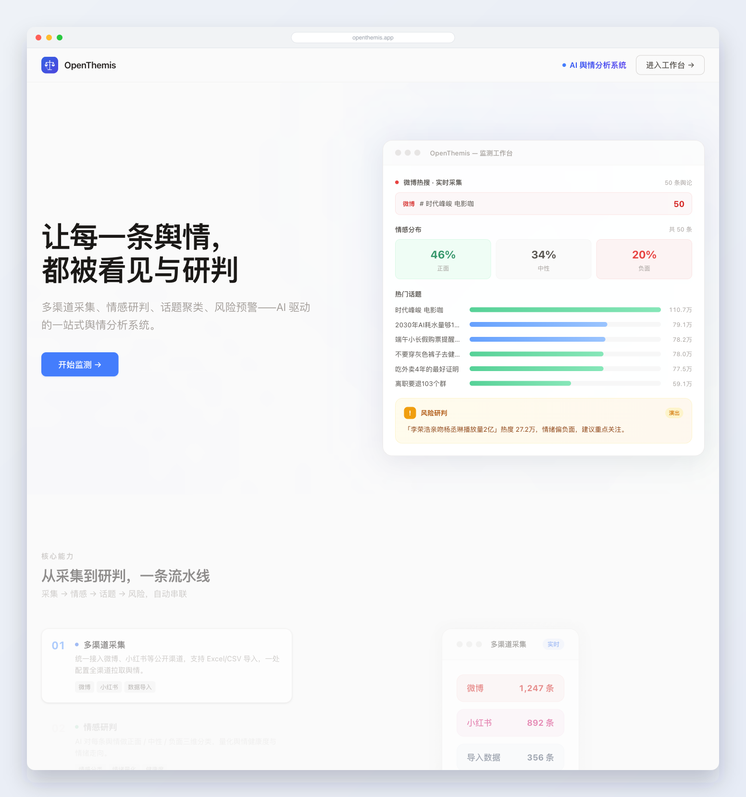
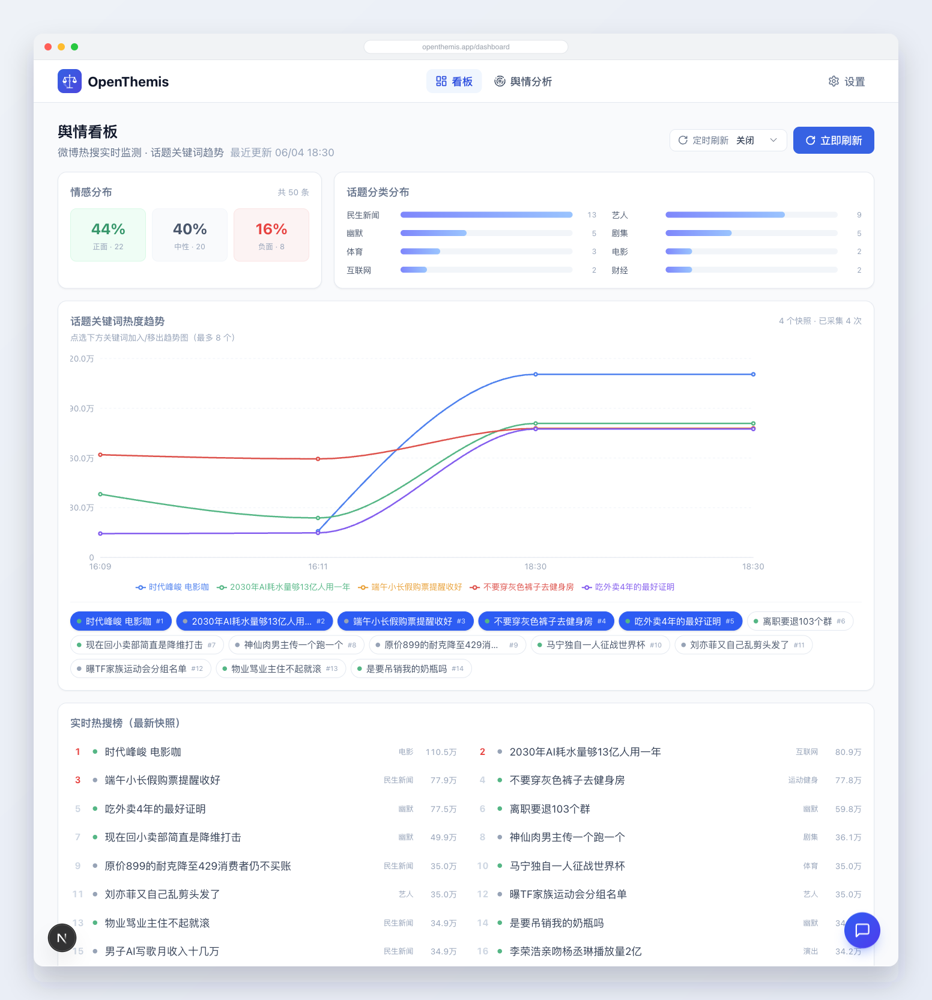
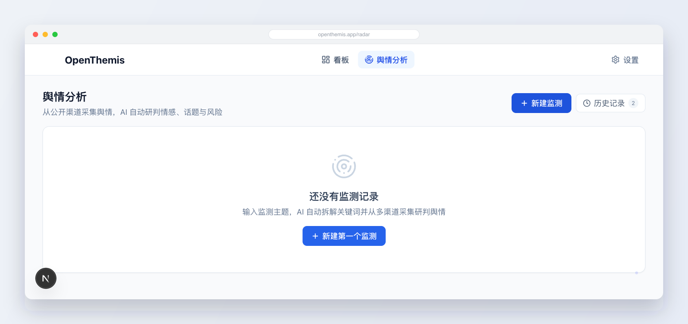
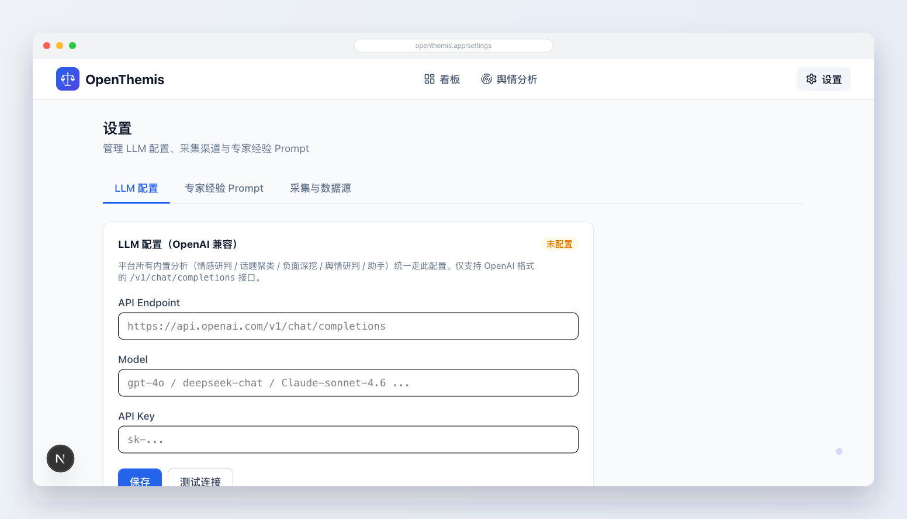

# OpenThemis — Themis 舆情分析系统

> 多渠道采集、情感研判、话题聚类、风险预警，一站式 AI 舆情分析。

---

## 一、产品定位

OpenThemis（Themis 舆情分析系统）是一个面向品牌、公关与运营团队的 **AI 驱动舆情分析系统**。从公开渠道自动采集舆情，经 AI 流水线完成情感分类、话题聚类、负面深挖与风险研判，帮助用户快速掌握舆情态势、及时预警风险。

## 二、核心能力

采用 **「采集 → 情感 → 话题 → 风险」** 自动串联的分析流水线：

1. **多渠道采集**：统一接入微博、小红书等公开渠道，支持 Excel/CSV 导入；登录态复用浏览器会话，无需在应用内单独登录。
2. **情感研判**：对每条舆情做正面 / 中性 / 负面三维分类，量化舆情健康度与情绪走向。
3. **话题聚类**：自动识别讨论的核心话题及其情感倾向，定位高热、高负面议题。
4. **风险预警**：深挖负面舆情、判定严重性（系统性缺陷 vs 偶发抱怨），提炼关键研判点与应对建议。

全局还提供**页面感知型 AI 舆情助手**，可基于当前页面数据实时答疑。

## 三、界面预览

### 首页 · 实时舆情概览
启动后从微博渠道随机捞取热搜话题，实时展示情感分布、热门话题与风险研判。

<p align="center"></p>

### 舆情看板 · 定时刷新 + 话题关键词趋势
支持 30 秒 / 1 / 5 / 10 分钟定时刷新，折线图展示关键词热度随时间的变化，并提供情感分布、分类分布与实时热搜榜。

<p align="center"></p>

### 舆情分析 · 多渠道采集与研判
输入监测主题，AI 自动拆解关键词并多渠道采集，输出情感、话题、负面深挖与舆情研判。

<p align="center"></p>

### 设置 · LLM 配置（OpenAI 兼容）
所有内置分析统一走可视化配置的 OpenAI 兼容 LLM，支持热更新与连接测试。

<p align="center"></p>

## 四、技术架构（三层，可独立部署/替换）

```
┌─────────────────┐   HTTP 契约   ┌──────────────────┐   spawn   ┌─────────────┐
│   分析执行层     │ ───────────▶ │   采集层          │ ───────▶ │  OpenCLI    │
│  Next.js + LLM  │              │ (OpenCLI 网关)    │          │  (复用 Chrome 会话) │
│  统一 LLM 客户端 │ ◀─ 数据 ─── │  各渠道统一接入    │          └─────────────┘
└────────┬────────┘              └──────────────────┘
         │ Repository
┌────────▼────────┐
│   数据存储层     │   SQLite (better-sqlite3, WAL)
└─────────────────┘
```

- **分析执行层**：Next.js 16 全栈应用。所有内置分析统一经 `lib/llm.ts`（仅支持 OpenAI 兼容接口）调用，配置可在 Settings 页面热更新。
- **采集层**：独立 Node 进程（`collector/`），所有渠道统一通过 [OpenCLI](https://github.com/jackwener/OpenCLI) 的 `opencli <site> search` 接入，登录态复用用户 Chrome 会话。详见 `collector/README.md`。
- **数据存储层**：SQLite，单文件零配置。

### 技术选型

| 层级 | 技术 |
|------|------|
| 框架 | Next.js 16（App Router）+ React 19 |
| 样式/动效/图表 | Tailwind CSS 4 · Framer Motion · Recharts |
| 数据库 | SQLite（better-sqlite3, WAL） |
| LLM | OpenAI 兼容接口（可配置） |
| 采集 | OpenCLI 浏览器桥接 |
| 语言 | TypeScript 5.8 |

## 五、快速上手

### 环境要求
- Node.js 18+（采集层需 OpenCLI，要求 Node ≥ 21）
- 已安装并登录 OpenCLI 浏览器扩展（采集功能需要）

### 启动

```bash
# 1) 采集层（独立进程）
cd collector && npm install && npm start    # http://localhost:4001

# 2) 分析执行层
npm install
npm run dev                                  # http://localhost:3000
```

### 配置 LLM
进入 `设置 → LLM 配置`，填写 OpenAI 兼容的 Endpoint / Model / API Key 并测试连接。也可用环境变量 `LLM_ENDPOINT / LLM_API_KEY / LLM_MODEL` 兜底（见 `.env.example`）。

### 体验流程
1. 设置 → 采集渠道：确认渠道已登录（在 Chrome 登录对应平台）
2. 舆情分析 → 新建监测：输入监测主题，AI 拆解关键词并多渠道采集
3. 查看研判报告：情感分布、话题热度、负面深挖、舆情研判一屏呈现

## 六、项目结构

```
.
├── app/                  # Next.js App Router
│   ├── page.tsx          # 首页
│   ├── radar/            # 舆情分析主模块
│   ├── settings/         # 设置（LLM 配置 / 采集渠道 / 提示词）
│   └── api/              # API 端点（channels / radar / prompts / llm-config / assistant ...）
├── components/           # UI 组件（layout / radar）
├── lib/                  # 核心库
│   ├── llm.ts            # 统一 LLM 客户端（OpenAI 兼容）
│   ├── agent.ts          # 舆情分析 Agent（情感/话题/负面/研判）
│   ├── analysis.ts       # 分析主流程编排
│   ├── collector-client.ts # 采集层 HTTP 客户端
│   ├── data-adapter.ts   # 数据适配（渠道 + 导入）
│   ├── db.ts             # SQLite
│   └── types.ts          # 类型定义
├── collector/            # 采集层（独立 OpenCLI 网关进程）
└── data/                 # 运行时数据（SQLite，gitignored）
```
